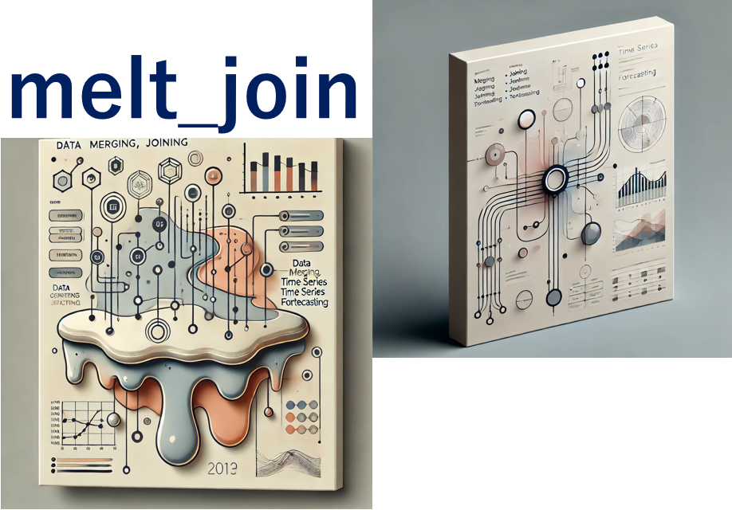

# melt_join

  

---
# Purpose of this tool
Performing time series forecasting is often tedious and difficult in both R and python.   
It is especially tedious for beginners.

At first, one might try simple waveform data as time series data,   
but with more realistic data, it is often necessary to immediately merge in other information.  
Designing features is also troublesome.

This tool aims to perform these tasks with GUI operation, and to perform time-series forecasting without thinking about details.

---
# Tutorial
[tutorial-1](./tutorial-1.md)  
[tutorial-2](./tutorial-2.md)  

