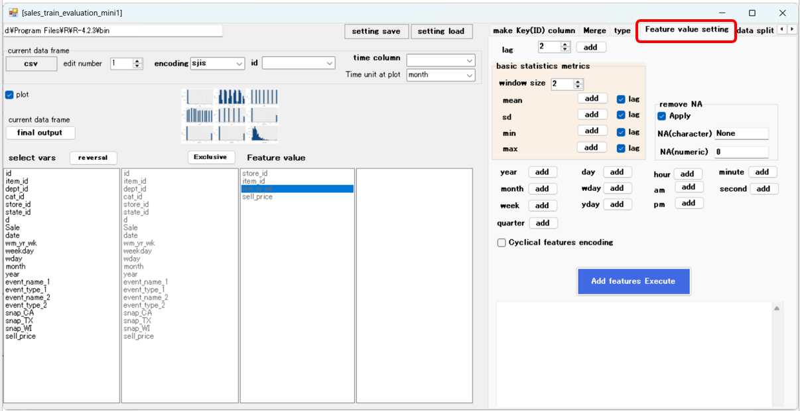

# Tutorial 

## Tutorial-1
This tutorial will walk you through the process of preparing data for a competition submitted on kaggle to produce a multivariate time series forecast. The tutorial will cover the steps of preparing the data for machine learning and merging it with other data to add information.

https://www.kaggle.com/c/m5-forecasting-accuracy  
Forecasts sales of merchandise in stores at various locations over a 28-day period.

The csv data used is sales_train_evaluation_mini.csv, which is a subset of kaggle (M5-forecasting) data. csv data is provided in three files. What we are trying to do is merge information from csv data and change it into vertical format for machine learning.
  
  

In the vertical direction, stores, product categories, etc. are recorded. 
  

The data recorded in d_1 to d_1941 will be sorted vertically, and the retailers, product categories, etc. will remain fixed. Set the vertical sort column name to d and the value column name to Sales.  

  

As a result of the edit, the data recorded in d_1 to d_1941 will be sorted vertically, and retailers, product categories, etc. will remain fixed.  
  

Go to merge tab and merge with calendar.csv
This file contains information such as the dates of events such as religious ceremonies and sports, and the days when SNAP (Federal Nutrition Assistance Program) is available.

Merge this information with the previous data.  
  

Decide which columns to match and merge  
  

  

Calendar.csv information has been integrated  
  

Do the same and merge with sell_prices.csv.
This file contains weekly sales prices for each store and product.  
  
  

Now all the information is merged and ready for machine learning  
  

Go to additional feature settings tab  
  

Set the id and time items that serve as multivariate identification, and the unit of the time record.  
  

Add the average, standard deviation, and respective lag values ​​for the past 7, 14, and 28 days of Sale data to the features.  
  

Features have been added.  
  

Next, split the data. Separate training, validation, and testing.  
Separation is set by time, but it is also possible to set separation percentage.  
  

The divided data will be output to the working directory  
  

Create a predictive model using xgboost. There are various parameters here that you can set.  
  

Select objective and explanatory variables and start training. You can select explanatory variables at once, including variables other than the objective variable.  
  

Once the model has been generated, the variables that are important to the model will be indicated  
  

Run the prediction  
  

A graph of the prediction results is displayed.  
  

Up to 25 randomly selected sequences are displayed on the melt_join UI.
Actually, all prediction results are output as a csv file in the work directory.  
 

(1)To make predictions using future data instead of the original data, you can set the date and time to the future here.  
   
However, we do not recommend extending this sample period here. This is because it needs to be expanded during the merge phase with calendar.csv.   

This data needs to be expanded while remaining in landscape format.  
Data is up to 1941 d_1941. If you want to extend this by 14 days, the first number = 1941
Addition number=14  
   

