# Tutorial 

## Tutorial-2
This is an application example of univariate time series forecasting.
Let's merge event information and see the effect on prediction accuracy at the time of an event.  
Time-series data of page views for the date and time of Peyton Manning on Wikipedia.  

The regular season for American football (NFL) is the playoffs from September to December, and the Super Bowl from January to February.
As a result, Peyton Manning's Wikipedia views may increase.  

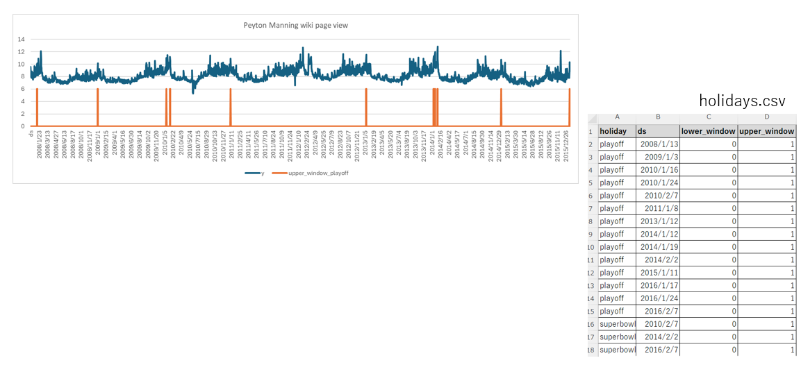   
Prepare holiday.csv for modeling holidays and events.
Enter the event name in the holiday column and the date of the event in the ds column.
Then set the event flag to upper_window.
Actually, you can just use the ds column and the event flag column.
*This format has been adapted from the Prophet format.  

Match the ds columns and merge them with holiday.csv.  
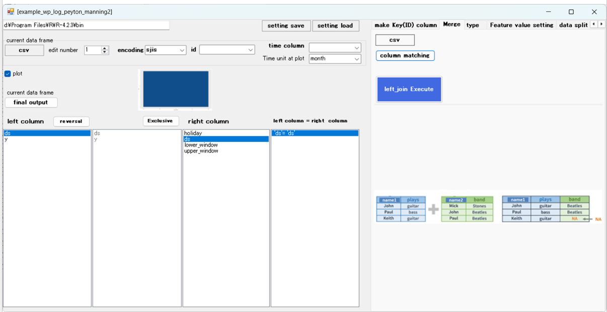   

Merged with holiday.csv. 
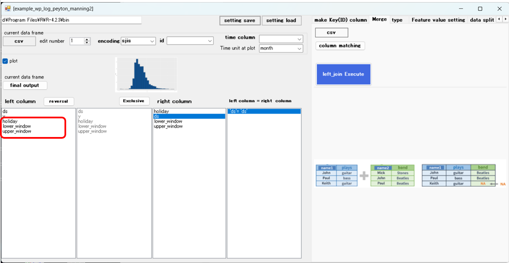   

Add features.
Add the average and standard deviation, month and day of the week information for the past 2 weeks and the past 4 weeks.  
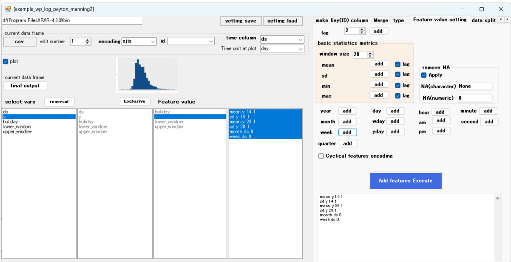  

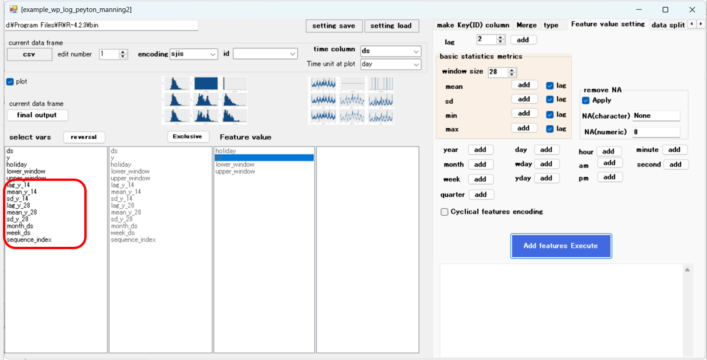  

Split your data into training, validation, and prediction.
split ratio
Let's say 80% for training, 10% for validation, and 10% for prediction.  
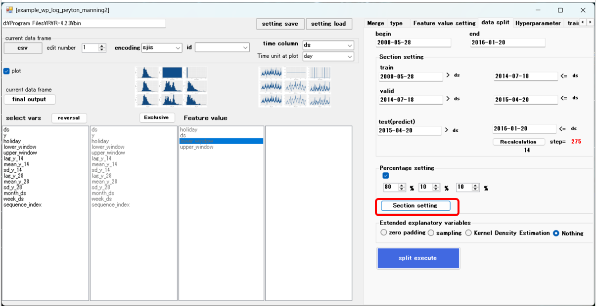  

The importance of variables is as follows.  
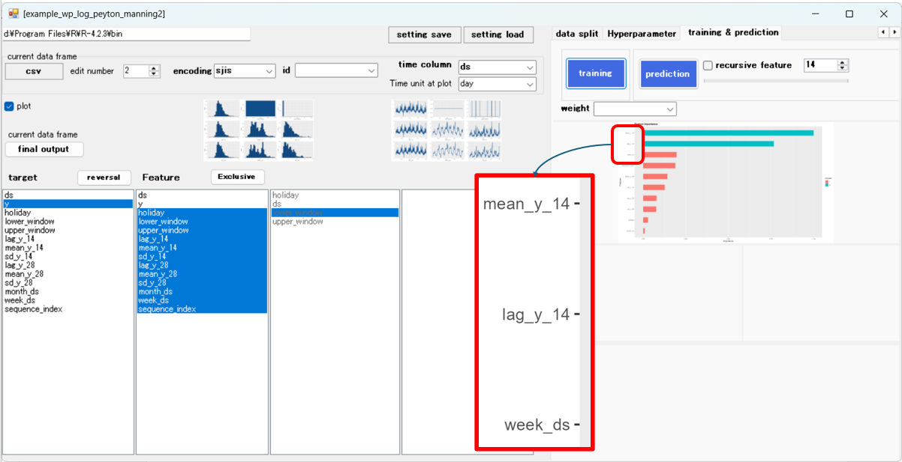  

Prediction result  
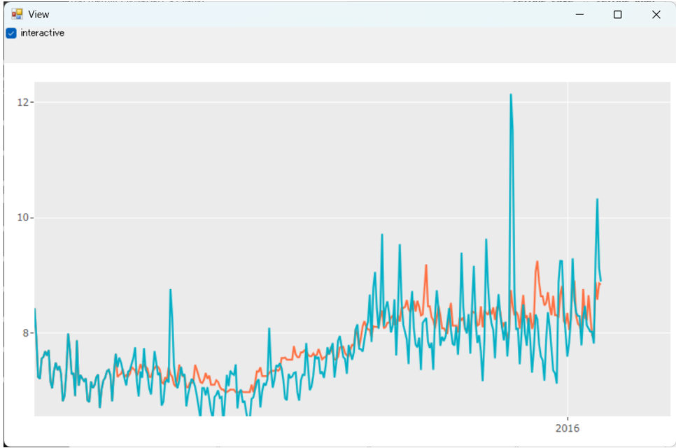  

Let's train it to react greatly to event information.  
The importance of variables is as follows.  
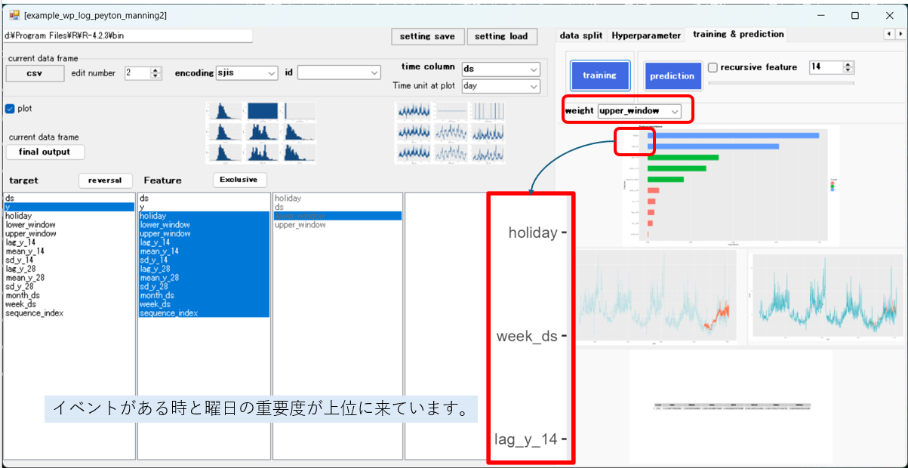  

The importance of the time and day of the week when there is an event is ranked high.  

Prediction result  
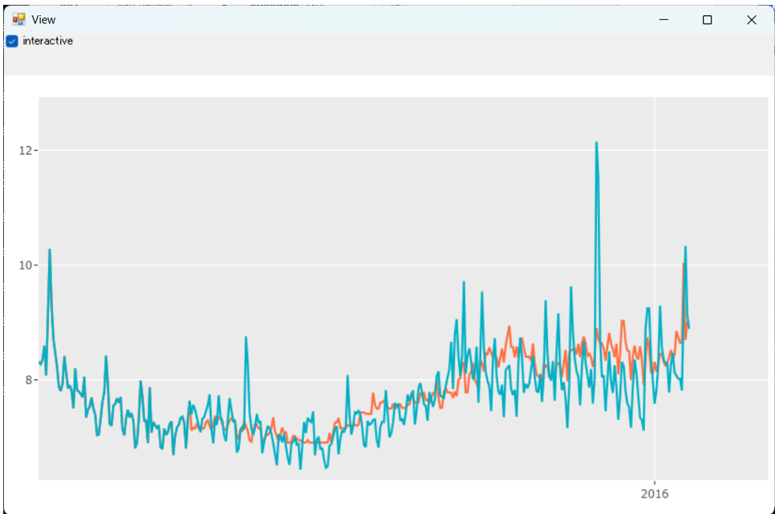  

Predictions when events occur are becoming more accurate.  
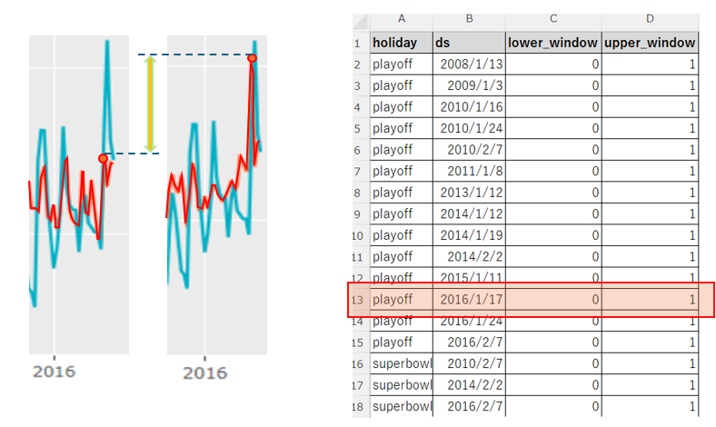  
